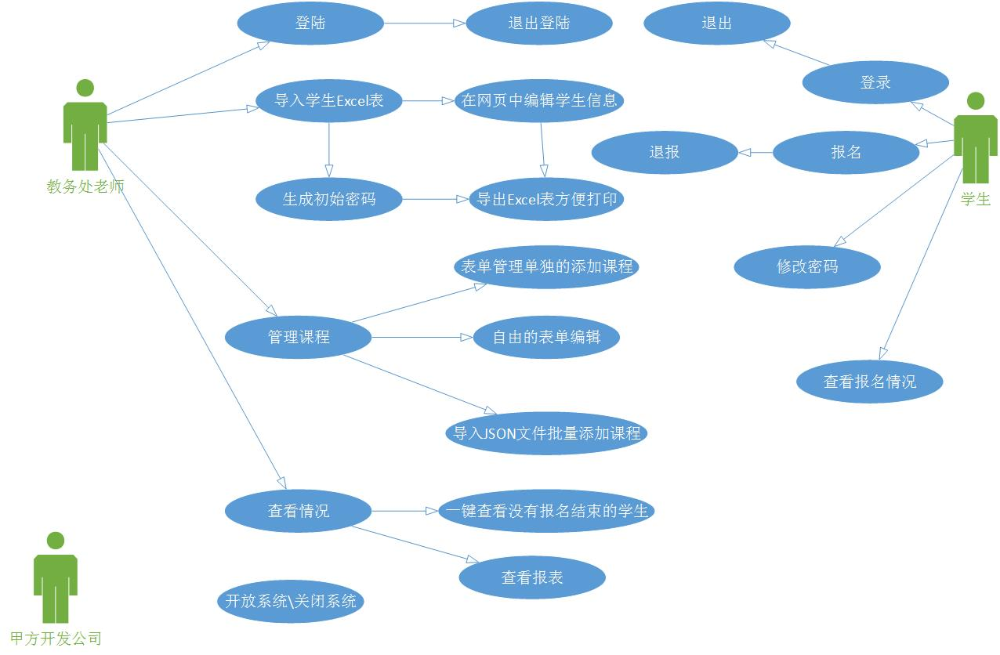

## 选修课报名系统（ECRS）

   ####1、技术栈：express、express-session、formidable、jquery、mongoose、bootstrap、ejs、node-xlsx

   ####2、技术选型：
   
    服务器破还要高并发，nodejs很适合，并且选修课系统都是io没有计算，nodejs更适合了。
    
   ####3、需求分析：
   
    1、在选课之前，为了防止学生给别人乱报名，所以需要给学生生成不同的初始密码，并印刷密码条由班主任亲自放到学生个人。
    
    解决方法：在项目中提供导入excel表，让系统自动识别学生，生成初始密码，导出excel表，方便教务处老师打印。
    
    2、每个学生限选两门课程，并且系统需要验证课程不在同一天，课程有年级限制，必须符合年纪规定的才能报名。
    
    解决方法：北航的选修课是周二、周三、周五开设，每天只有一门课，都是下午最后一节课之后。一个学生如果周二报名了一节课，此时将不能继续报名周二的课程。每个学生总数是两门课程    ，不能多选。
    
   ####4、用例图：
   
   
   
   
   ####5、业务技术点：
   
    1、Excel表格的识别，使用node-xlsx插件来处理。
    2、上传excel时，要彻底删除所有的数据。
    
   ####6、数据库：
   
    1、要有mongoose数据库，students集合。
        {“sid”:100001,"name":"李华","grade":0}
        grade 是年级：初一、初二、初三、高一、高二、高三
    2、在重新上传excel表格之前要把数据库清零。
    3、初始化密码要加密 MD5、sha256、sha1。
    4、实现密码的持久化
    
   ####7、富表格显示：   
    
    jqGrid
    
   ####8、导入图：
   
       
   
     

     
   
   ####9、模糊查询：

    使用真正表达式的构造函数来将字符串转为正则对象
    
   ####10、模糊查询：
   
   

   ####11、密码正则以及密码强度：

   ####12、Get请求和POST请求在NodeJS中如何得到，必须要知道：  
       
       GET请求：
       var page = url.parse(req.url,true).query.page;
       
       POST请求：
       var form = new formidable.IncomingForm();
       form.parse(req,function(err,fields,files){
       
       })
       
       parma 参数得到：
       
       req.params.sid
       
   ####12、RESTful  
        
       查询所有学生，get请求到 /student
       增加学生，post 请求到 /student
       查询某学生，get请求到 /student/100001
       修改学生，post请求到 /student/100001
       删除学生，del 请求到 /student/100001
       查询某学生是否存在，profind 请求到 /student/100001
       
       
       
       
       
       
       
       
       
       
       
       
       
       
       
       
       
   
   
   
